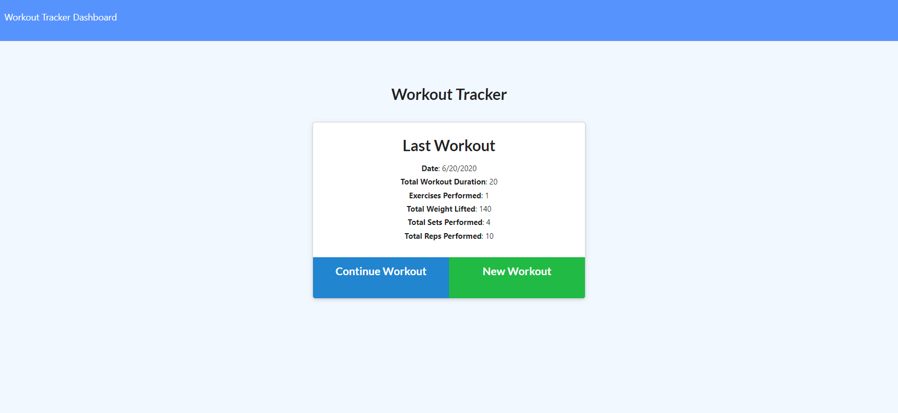
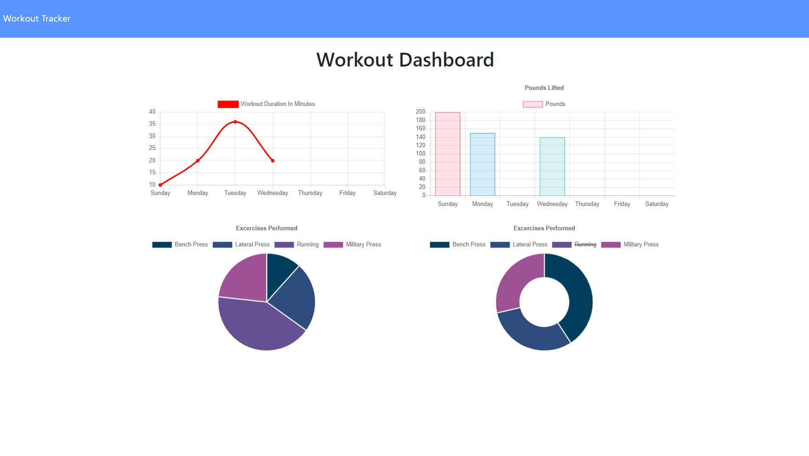
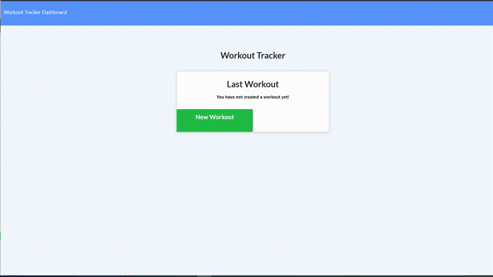

# Welcome to Workout Tracker by Joy Chen

[](https://shields.io/) [](https://shields.io/) 
[](https://shields.io/) [](https://shields.io/) 
  
## Description
  
This application will assist you in keeping track of your workouts! If you love cardio and/or resistance training, this is the application for you. It will assist you in tracking the weight, the reps, the sets, the duration, and the milage you put in. You work hard enough to make those gains; let this application track those gains for you. On the dashboard tab, you can see graphs of your progress and how you divide up your time and workouts. This application utilizes Express and MongooDB to create a full user experience.

<div align="center"></div>
<div align="center"></div>


## User Story

As a workout enthusiast, I want to use this application to keep track of my workouts, so that I can see how I am progressing

  
## Table of Contents
* [Installation](#installation)
* [Usage](#usage)
* [Demo](#demo)
* [Questions](#questions)

  
## Installation

To use this application, run the following commands in your terminal to install the appropriate packages
```
    npm install
```

## Usage 

After you've installed the packages, to run the application, just navigate to the deployed site at https://workout-tracker-by-joy.herokuapp.com/ or they can navigate to the github repository and run the code there using 
```
    node server.js
```


## Demo
<div align="center"></div>

## Questions
  
If you see any improvements that can be made, please email me at joychen5069@gmail.com. You can also visit my GitHub page at https://github.com/joychen5069 or visit the Workout Tracker page at https://github.com/joychen5069/WorkoutTracker

  